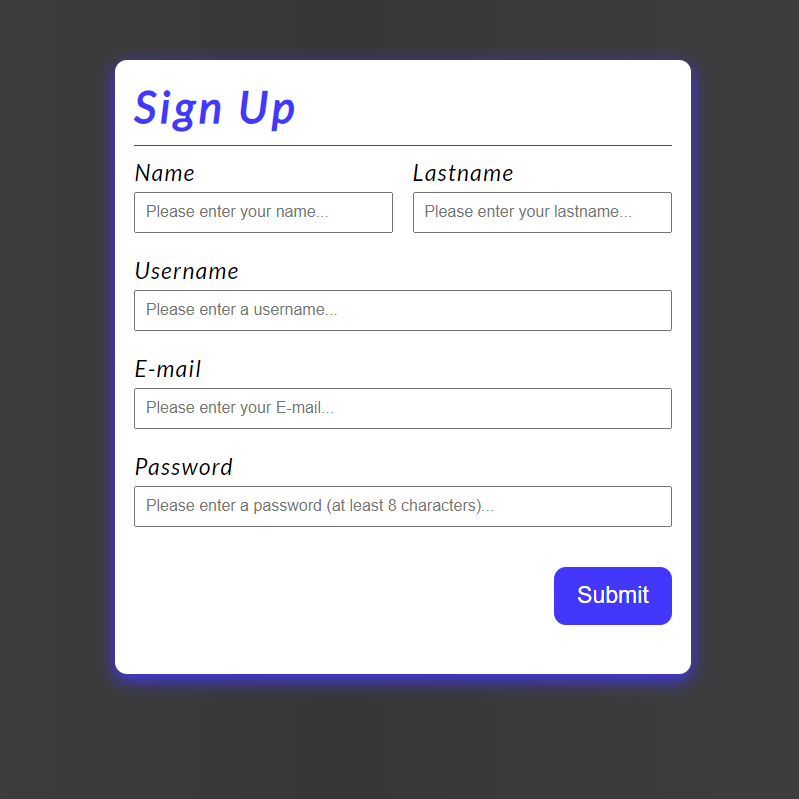
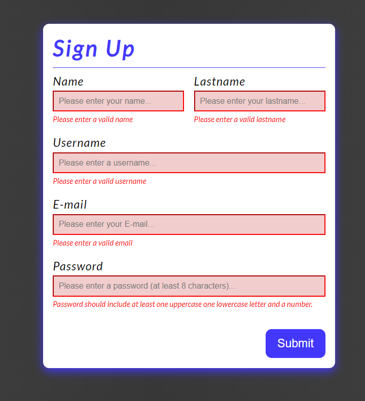

# Sign-Up Form
It is a basic sign-up form to practice React custom hooks and form validation.
I didn't handle form submission yet. It was just for practicing working with inputs and creating use-input hook

### Default View

### All inputs are incorrect
